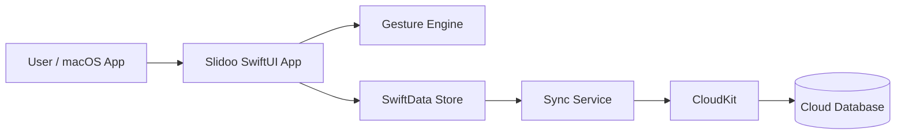
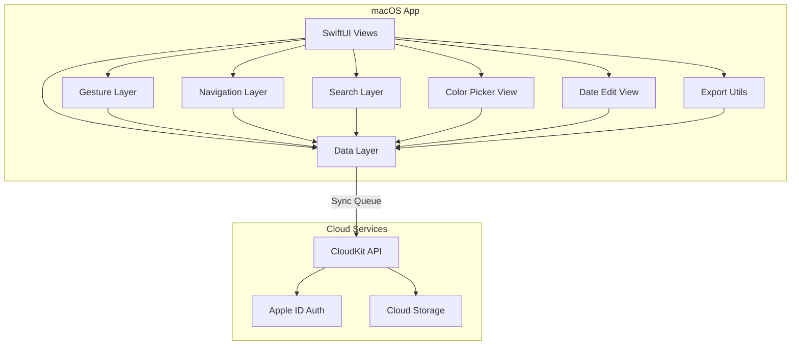

# Architecture

> **Language notice**: All documentation in this project is written exclusively in English.

## Overview

Slidoo is a native macOS desktop application built with **Swift + SwiftUI**, managed in **Xcode**. It uses a local-first architecture with SwiftData persistence and optional cloud sync. The UI targets macOS desktop windows with mouse/trackpad drag-based interactions and keyboard shortcuts.

## Tech Stack

- **Language**: Swift
- **Framework**: SwiftUI (macOS 14+ / Sonoma)
- **Build System**: Xcode
- **Testing**: XCTest + XCUITest (or Swift Testing framework)
- **Storage**: SwiftData (`@Model` + `ModelContainer`)
- **Styling**: SwiftUI view modifiers and custom `ViewModifier`s

## Main components

- **SwiftUI App** - the native macOS application using SwiftUI App lifecycle (`@main`)
- **Drag Gesture Engine** - SwiftUI `DragGesture` on `TaskBarView` handling horizontal drag detection, 10pt dead zone, progress calculation, and disambiguation from single click (drill-down)
- **Task Data Store** - local-first storage via SwiftData (`TaskStore` `@Observable` class with `ModelContext`) for tasks and progress
- **Sync Service** - (Phase 4) optional CloudKit integration for persisting and syncing user data across devices
- **Auth Module** - (Phase 4) Apple ID authentication for cloud sync features

## Module structure

- **UI Layer** - SwiftUI views: `SlidooApp`, `ContentView` (NavigationStack host), `TaskLevelView` (per-level container with header + list + sheet), `HeaderView` (with back button, dynamic navigation title, search mode, export button), `TaskListView` (dynamic `@Query` by parentId), `TaskBarView` (with subtask count badge, date row, overdue indicator), `TaskCreateSheet` (with parentId/level for subtask creation), `EmptyStateView` (context-aware text), `ColorPickerView` (7-swatch palette popover), `DateEditView`, `SearchResultsView` (with breadcrumbs). Context menu via `.contextMenu` modifier (Rename, Change Color, Set Dates, Delete). Confirmation dialog via `.confirmationDialog()` modifier
- **Gesture Layer** - `DragGesture` on `TaskBarView`: 10pt dead zone, drag threshold to distinguish click from drag, progress percentage calculation. Drag disabled on parent tasks (D009)
- **Navigation Layer** - `NavigationStack` with path-based navigation for drill-down/back between task hierarchy levels
- **Data Layer** - `TaskStore` (`@Observable` class) + SwiftData `ModelContext`: CRUD operations for tasks, query by parentId, recursive cascade deletion, progress rollup calculation, color/date updates, SwiftData persistence
- **Search Layer** - Search state management with async `Task.sleep` debounce (200ms). Case-insensitive name filtering across all levels and breadcrumb building. Integrated via SwiftUI `.searchable()` modifier on `NavigationStack`
- **Utility Layer** - `DateUtils` (date formatting, days-left calculation, overdue detection, date range validation), `ExportUtils` (JSON export via `Codable` + `NSSavePanel`)
- **Service Layer** - (Phase 4) CloudKit client for backend sync, conflict resolution logic

## Feature documentation

- Feature index: [`docs/features/INDEX.md`](features/INDEX.md)
- Glossary: [`docs/GLOSSARY.md`](GLOSSARY.md)
- NFR: [`docs/nfr/NON_FUNCTIONAL.md`](nfr/NON_FUNCTIONAL.md)

## Diagrams





## Main flow

1. User opens Slidoo on macOS
2. App loads, reads top-level tasks (parentId == nil) from SwiftData
3. User sees task list with colored progress bars (with date rows below bars showing deadlines)
4. User clicks and drags horizontally on a leaf task bar to update progress
5. Gesture engine calculates new percentage, updates UI in real-time (60fps)
6. User clicks any task to drill down into its subtask view; `NavigationStack` pushes parentId
7. Subtask list renders with same UI; user clicks back button or presses Cmd+[ to pop navigation
8. Parent task progress auto-updates as average of direct children (D009)
9. User right-clicks a task and selects "Change Color", "Set Dates", "Rename", or "Delete" from the context menu (D011)
10. User clicks search icon or presses Cmd+F to enter search mode; types query to filter tasks across all levels with breadcrumbs
11. User clicks export button or presses Cmd+E to save all task data as JSON via `NSSavePanel`
12. Data layer persists all updates via SwiftData
13. Sync service queues update for CloudKit sync (when online)

## Keyboard shortcuts

| Shortcut | Action |
|---|---|
| Cmd+N | New task |
| Cmd+F | Search tasks |
| Cmd+E | Export tasks as JSON |
| Cmd+[ | Navigate back |
| Delete / Backspace | Delete selected task (with confirmation) |
| Escape | Cancel current action / dismiss sheet |
| Return | Confirm input |

## macOS menu bar

- **File**: New Task (Cmd+N), Export (Cmd+E), Close Window (Cmd+W)
- **Edit**: Rename, Delete (Delete/Backspace)
- **Navigate**: Back (Cmd+[)
- **View**: Search (Cmd+F)
- **Window**: Standard macOS window management
- **Help**: About Slidoo

## Data Model

### Task Entity

| Field | Type | Constraints | Description |
|---|---|---|---|
| `id` | UUID | Primary key | Unique identifier (Swift `UUID()`) |
| `name` | String | Max 100 chars, non-empty | Task display name (truncated with ellipsis on overflow) |
| `progress` | Int | 0–100 | Completion percentage. Manual via drag for leaf tasks; auto-calculated average of direct children for parent tasks |
| `color` | String | Hex (e.g., "#4A90D9") | Task bar color. Assigned sequentially from 7-color palette on creation; customizable via ColorPickerView |
| `parentId` | UUID? | FK to Task.id | Nil for top-level tasks; references parent for subtasks |
| `level` | Int | 1–5 | Nesting depth (1 = top-level). Max 5 levels enforced on creation |
| `startDate` | Date? | — | Optional start date |
| `endDate` | Date? | — | Optional end date / deadline. Displayed below task bar with "X DAYS LEFT" countdown |
| `createdAt` | Date | — | Creation timestamp |
| `updatedAt` | Date | — | Last modification timestamp |

Implemented as a SwiftData `@Model` class:

```swift
@Model
class SlidooTask {
    var id: UUID
    var name: String
    var progress: Int
    var color: String
    var parentId: UUID?
    var level: Int
    var startDate: Date?
    var endDate: Date?
    var createdAt: Date
    var updatedAt: Date
}
```

### Progress Rollup Rules

- **Leaf task** (no subtasks): progress is manual, updated via drag gesture (integer 0–100).
- **Parent task** (has subtasks): progress = arithmetic average of direct children's progress (rounded to nearest integer). Drag gesture is disabled.
- When the last subtask is deleted, the parent reverts to manual progress, retaining its last computed value.
- When a first subtask is added to a manual task, the parent switches to auto-rollup.

## Window management

- Minimum window size: 800×600 points
- Resizable: task bars stretch to fill available width
- Configured via `WindowGroup` in the SwiftUI App lifecycle
- Dark appearance enforced via `.preferredColorScheme(.dark)` (D013)

## Scaling decisions

- Native macOS rendering with no server dependency for core functionality
- Offline-first: app remains fully functional without internet
- Sync uses eventual consistency model with last-write-wins conflict resolution (CloudKit)
- Cloud sync is stateless from the app perspective, leveraging CloudKit's built-in conflict handling
