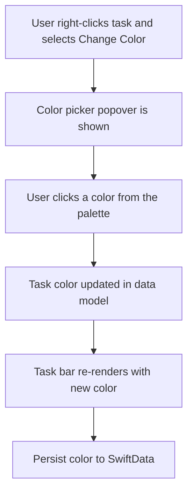
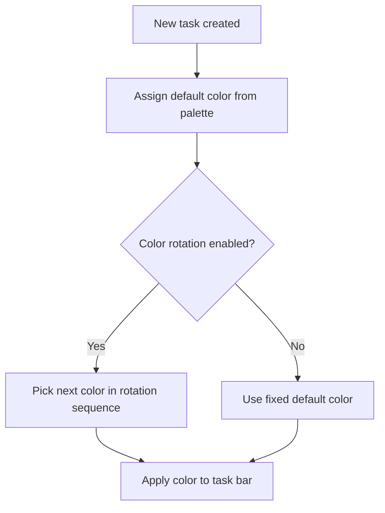

# Color Customization - Flows

> Mermaid diagrams for the main flows of the feature.
> Reference: [README.md](README.md) | [Glossary](../../GLOSSARY.md)

## Change Color Flow
> Traces: `REQ-COLOR-CUSTOM-002`, `REQ-COLOR-CUSTOM-005` | `AC-COLOR-CUSTOM-002`, `AC-COLOR-CUSTOM-005`

## Default Color Assignment Flow
> Traces: `REQ-COLOR-CUSTOM-001` | `AC-COLOR-CUSTOM-001`

