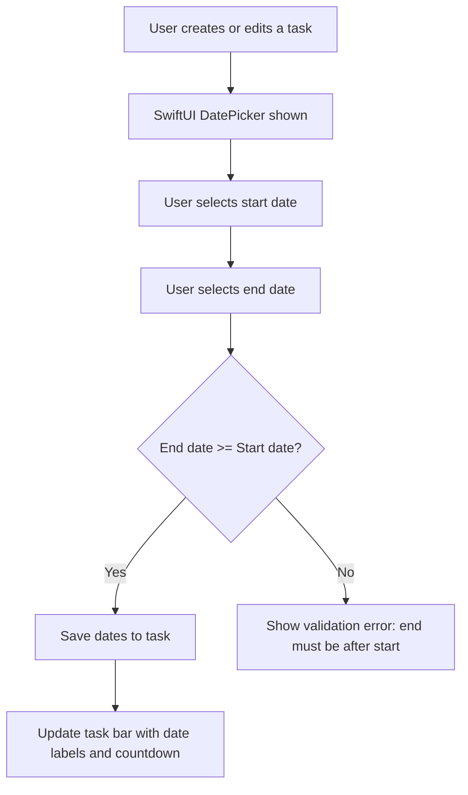
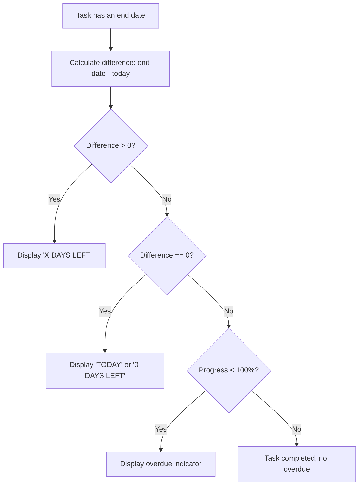

# Deadline Tracking - Flows

> Mermaid diagrams for the main flows of the feature.
> Reference: [README.md](README.md) | [Glossary](../../GLOSSARY.md)

## Assign Dates Flow
> Traces: `REQ-DEADLINE-001`, `REQ-DEADLINE-002` | `AC-DEADLINE-001`, `AC-DEADLINE-002`

## Days Left Calculation Flow
> Traces: `REQ-DEADLINE-005`, `REQ-DEADLINE-006` | `AC-DEADLINE-005`, `AC-DEADLINE-006`

