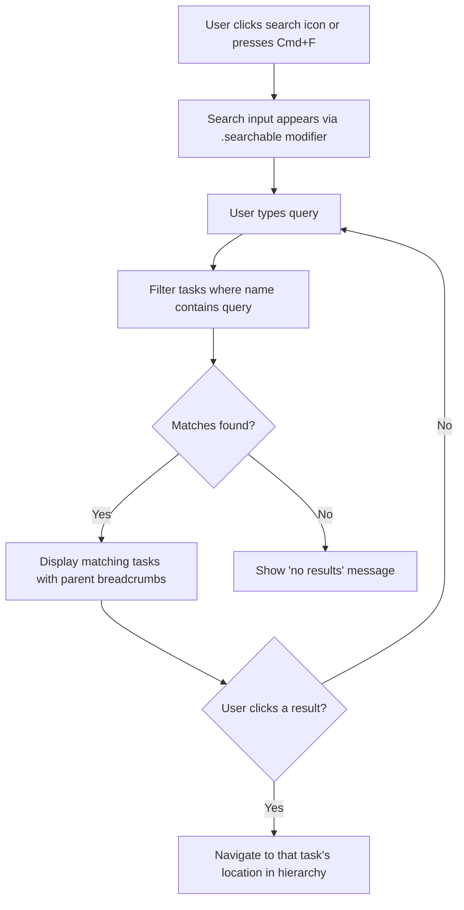
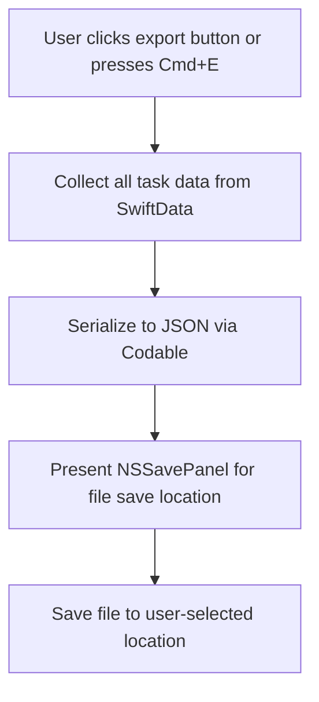

# Search & Export - Flows

> Mermaid diagrams for the main flows of the feature.
> Reference: [README.md](README.md) | [Glossary](../../GLOSSARY.md)

## Search Flow
> Traces: `REQ-SEARCH-EXPORT-001`, `REQ-SEARCH-EXPORT-002`, `REQ-SEARCH-EXPORT-003` | `AC-SEARCH-EXPORT-001`, `AC-SEARCH-EXPORT-002`, `AC-SEARCH-EXPORT-004`

## Export Flow
> Traces: `REQ-SEARCH-EXPORT-004`, `REQ-SEARCH-EXPORT-005` | `AC-SEARCH-EXPORT-003`

