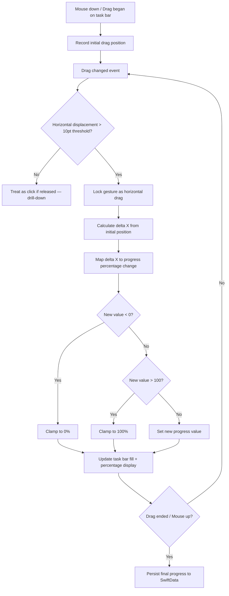
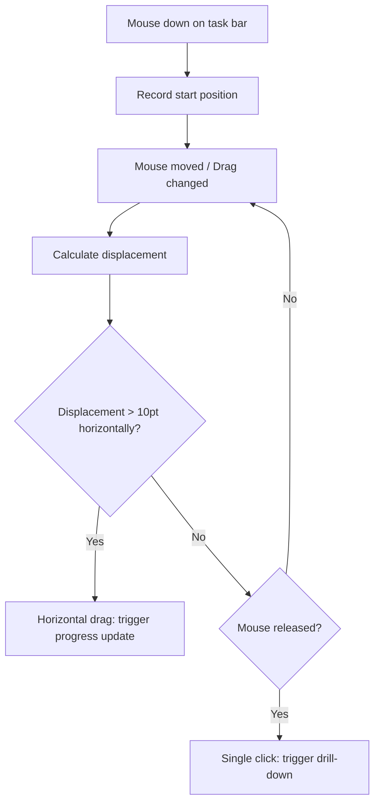

# Slide-to-Progress - Flows

> Mermaid diagrams for the main flows of the feature.
> Reference: [README.md](README.md) | [Glossary](../../GLOSSARY.md)

## Main Slide Flow
> Traces: `REQ-SLIDE-PROGRESS-001` through `REQ-SLIDE-PROGRESS-009` | `AC-SLIDE-PROGRESS-001` through `AC-SLIDE-PROGRESS-008`

## Gesture Disambiguation Flow
> Traces: `REQ-SLIDE-PROGRESS-008` | `AC-SLIDE-PROGRESS-007`

