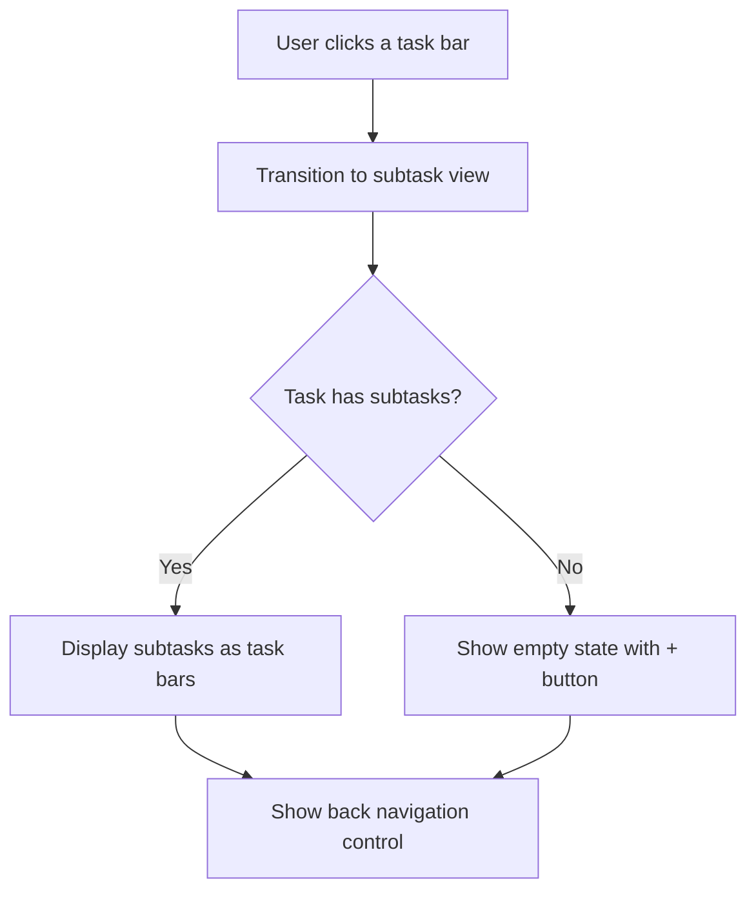
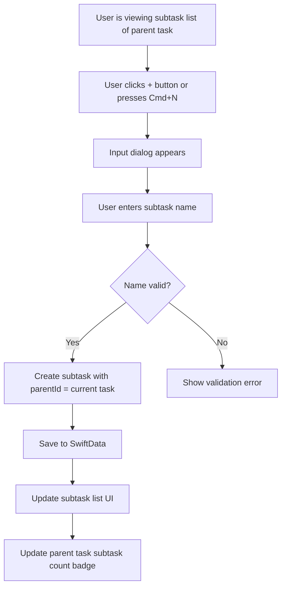
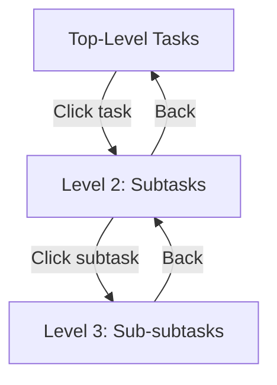

# Subtask Hierarchy - Flows

> Mermaid diagrams for the main flows of the feature.
> Reference: [README.md](README.md) | [Glossary](../../GLOSSARY.md)

## Drill-Down Navigation Flow
> Traces: `REQ-SUBTASK-HIER-003` | `AC-SUBTASK-HIER-003`



## Create Subtask Flow
> Traces: `REQ-SUBTASK-HIER-001`, `REQ-SUBTASK-HIER-006` | `AC-SUBTASK-HIER-001`, `AC-SUBTASK-HIER-006`



## Navigate Back Flow
> Traces: `REQ-SUBTASK-HIER-004` | `AC-SUBTASK-HIER-004`

```mermaid
flowchart TD
    A[User clicks back button or presses Cmd+[] --> B[Read parent task's parentId]
    B --> C{Parent has a parent?}
    C -->|Yes| D[Transition to grandparent's subtask list]
    C -->|No| E[Transition to top-level task list]
```

## Multi-Level Hierarchy Diagram
> Traces: `REQ-SUBTASK-HIER-002`, `REQ-SUBTASK-HIER-003`, `REQ-SUBTASK-HIER-004` | `AC-SUBTASK-HIER-002`


