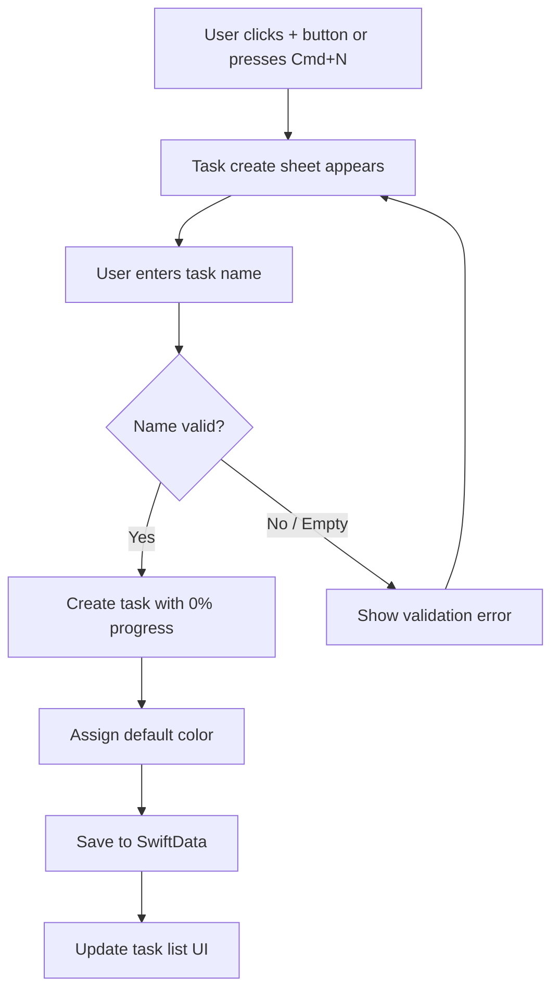
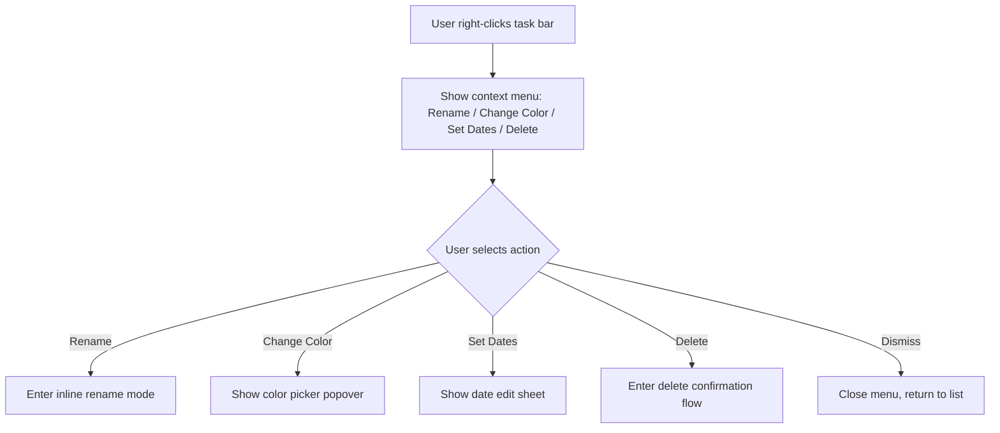
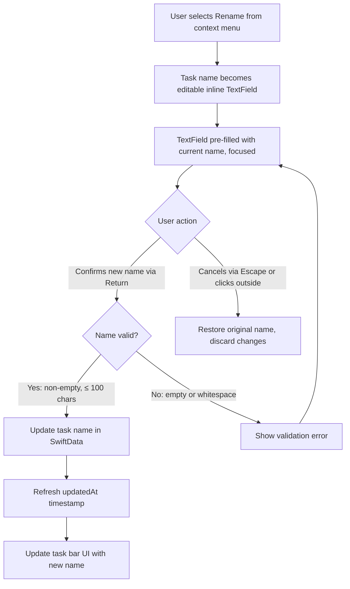
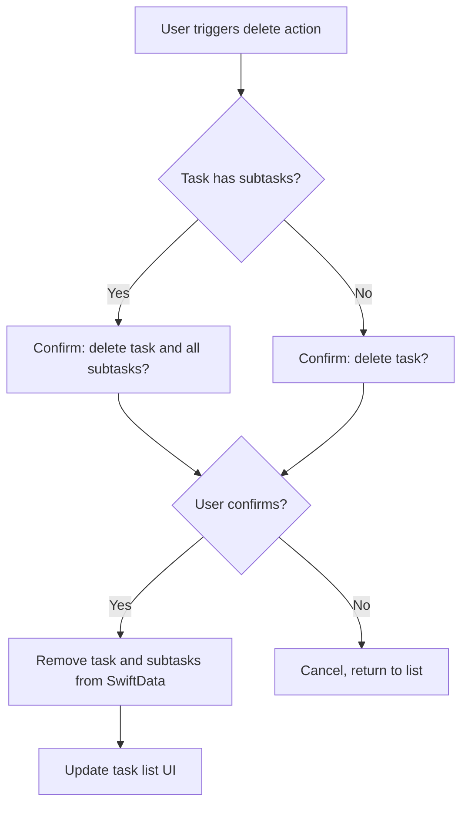
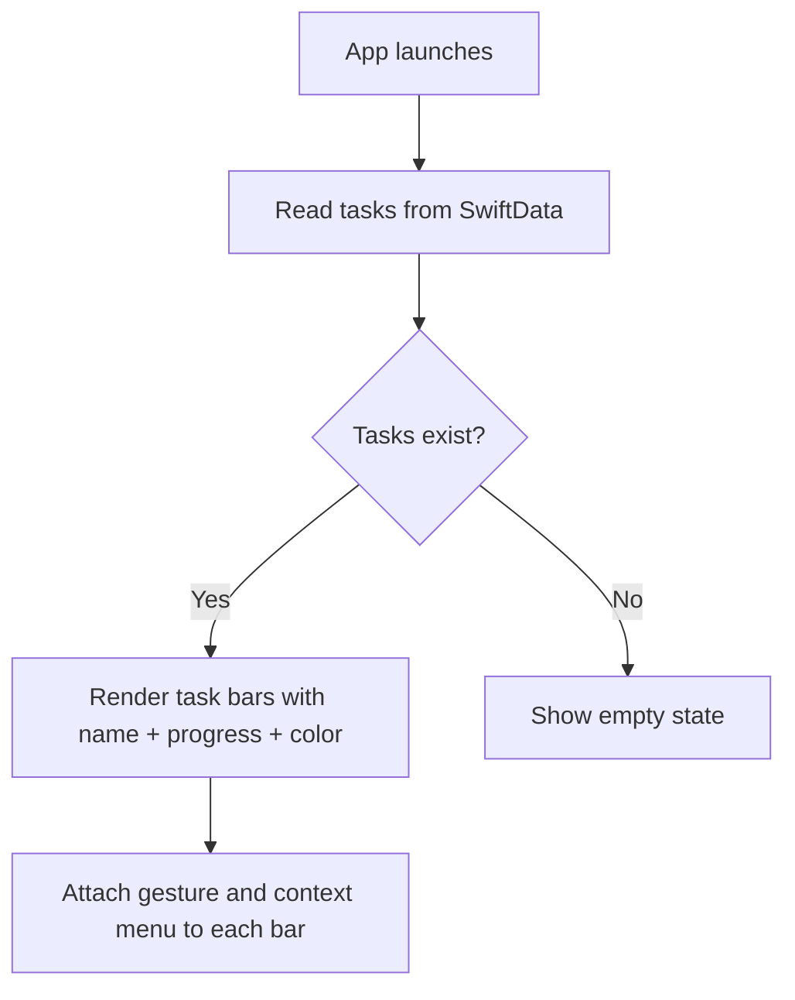

# Task Management - Flows

> Mermaid diagrams for the main flows of the feature.
> Reference: [README.md](README.md) | [Glossary](../../GLOSSARY.md)

## Create Task Flow
> Traces: `REQ-TASK-MGMT-001`, `REQ-TASK-MGMT-007` | `AC-TASK-MGMT-001`

## Right-Click Context Menu Flow
> Traces: `REQ-TASK-MGMT-009` | `AC-TASK-MGMT-007`

## Edit Task (Rename) Flow
> Traces: `REQ-TASK-MGMT-004` | `AC-TASK-MGMT-003`, `AC-TASK-MGMT-008`, `AC-TASK-MGMT-009`

## Delete Task Flow
> Traces: `REQ-TASK-MGMT-005` | `AC-TASK-MGMT-004`, `AC-TASK-MGMT-010`

## Task List Display Flow
> Traces: `REQ-TASK-MGMT-002`, `REQ-TASK-MGMT-003`, `REQ-TASK-MGMT-006` | `AC-TASK-MGMT-002`, `AC-TASK-MGMT-005`

